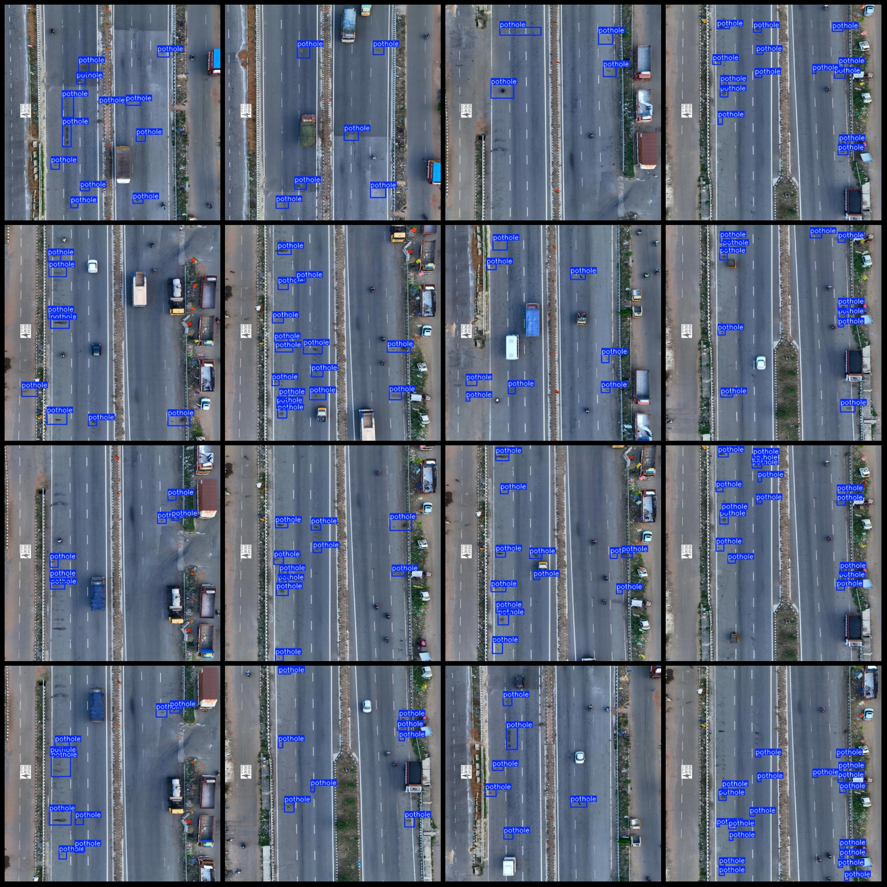
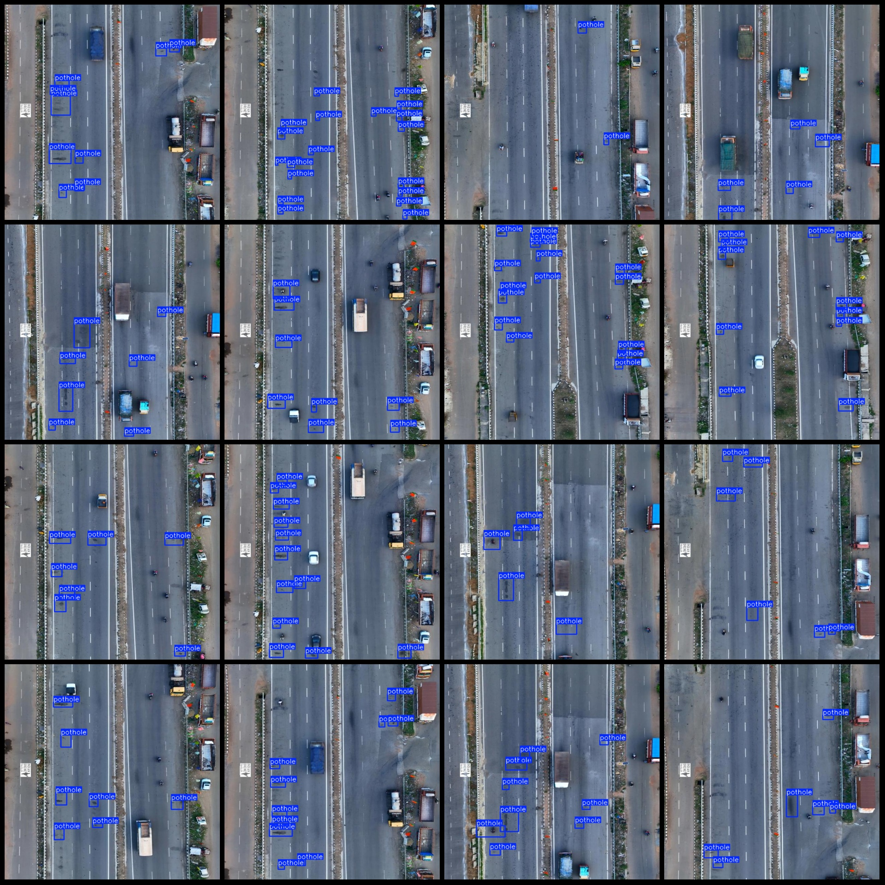

# Drone-View Road Pits Detection Dataset VOC+YOLO Format with 58 Images of 1 Category

Dataset format: Pascal VOC format + YOLO format (excluding the segmentation path in txt files, only containing jpg images along with corresponding VOC format xml files and YOLO format txt files)

Number of images (jpg file count): 58
Number of annotations (xml file count): 58
Number of annotations (txt file count): 58
Number of category labels: 1
Category label name: ["pothole"]
Number of bounding boxes for each category:
- pothole bounding box count = 483
Total bounding boxes: 483
Image resolution: 640x640
Drone: DJI MAVIC 3
Collection height: 20m
Collection angle: 90°
Annotation tool used: labelImg
Annotation rule: draw a rectangle around the category
Important note: The dataset does not have split into training validation test sets; you need to partition it yourself.
Special declaration: This dataset does not guarantee the accuracy of the trained model or the weight files.
Image preview:
## Picture

Here is a pay link on Stripe ( https://buy.stripe.com/3cs8yP7sY87d0vu9AB ). Please contact me lonlonago@foxmail.com after funding $89, and I will send you a complete data files , thank you!

